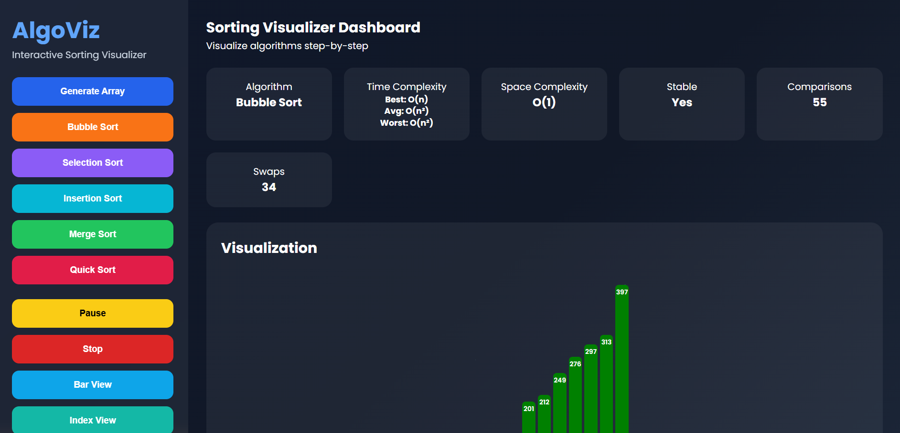
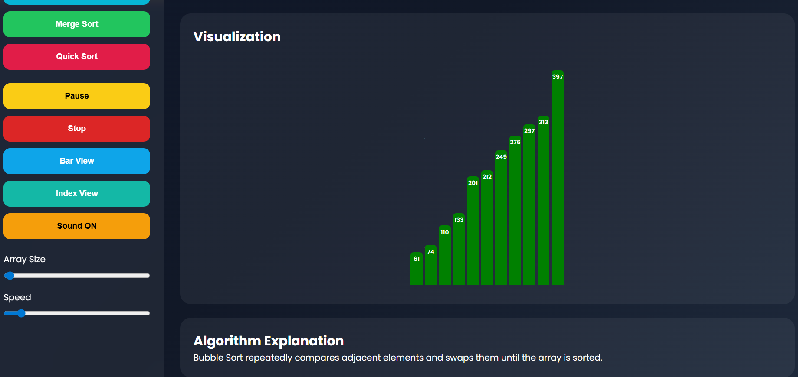
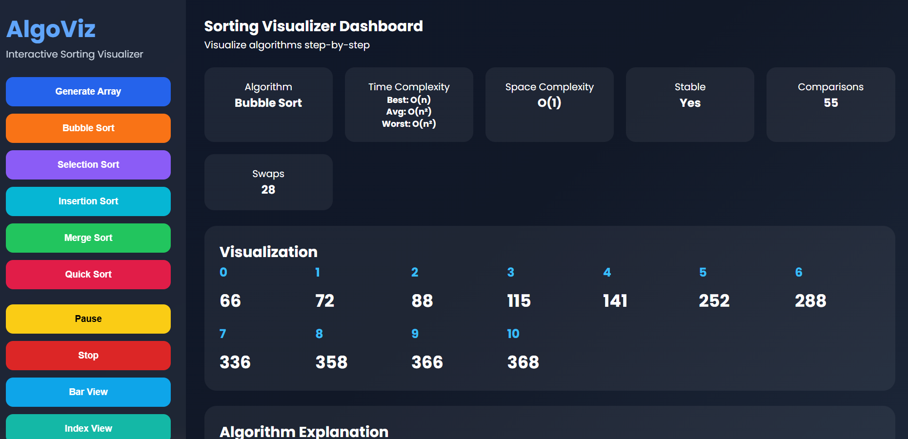
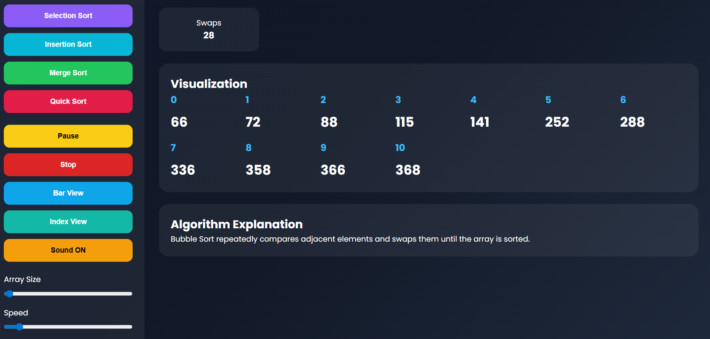

# 🔥 AlgoVisualizer - Sorting Algorithm Visualizer

A **real-time interactive sorting algorithm visualizer** built using **HTML, CSS, and JavaScript**.  
It helps understand how sorting algorithms work step-by-step with animations.

---

## 🚀 Features

-  Bubble Sort Visualization  
-  Selection Sort Visualization  
- Insertion Sort Visualization  
-  Merge Sort Visualization  
- Quick Sort Visualization  
-  Pause / Resume sorting  
-  Stop sorting anytime  
-  Sound effects for compare & swap  
-  Generate random arrays  
-  Bar +
  ## Tech Stack
- HTML
- CSS
- JavaScript

## Screenshots
### bar view

### visualizer Dashboard

### indexView

### indexVisualizer

## Author
Saurabh Kumar
